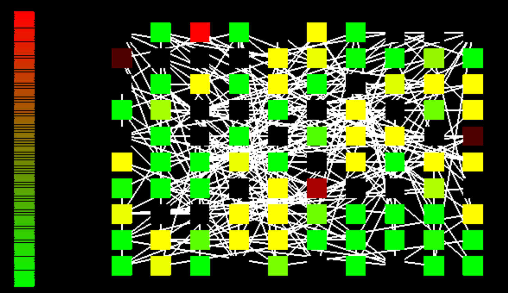

# Minimal Enerstatic Network
Visualization of a minimal enerstatic network as seen in the "Ensoul" paper.
Paper Link: 

## Getting Started

1) From the top most directory run "npm install", to install typescript related modules.
Run "npm run watch" if you want to modify any of the typescript files

2) To run this project I use Visual Studio Code Extension called "Live Server"
Link: https://marketplace.visualstudio.com/items?itemName=ritwickdey.LiveServer

It's a great way get this thing running fast.

Contact me at ty@tyfoodsforthought.com if you want to reach out to me!

### Prerequisites

1) Typescript- Node.JS
2) Live Server VScode Extension (Optional, but necessary for quick start)

## Authors

* **Ty Roachford** - [Tyfoods Github](https://github.com/Tyfoods)

See also the list of [contributors](https://github.com/Tyfoods/minimal-enerstatic-network/graphs/contributors) who participated in this project.

## License

This project is licensed under the Creative Commons License - see the [LICENSE.md](LICENSE.md) file for details